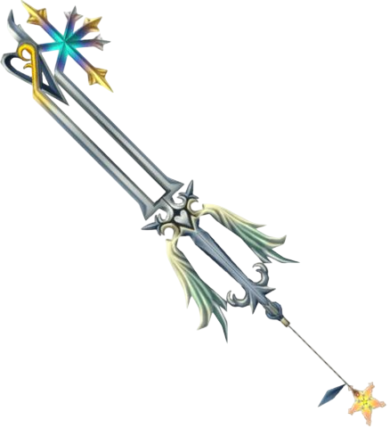
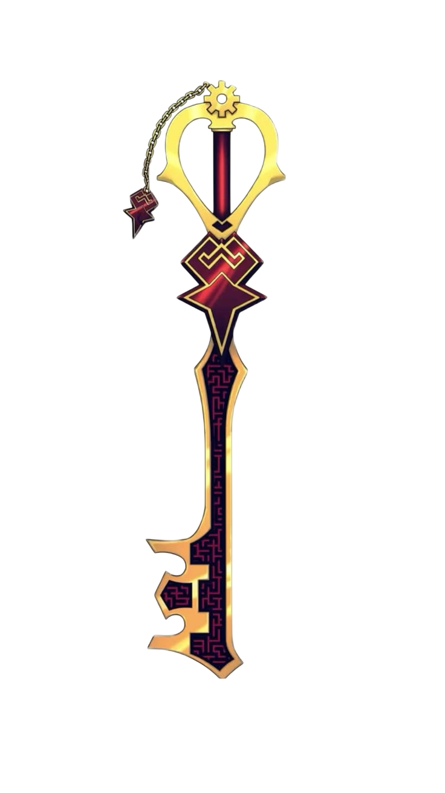
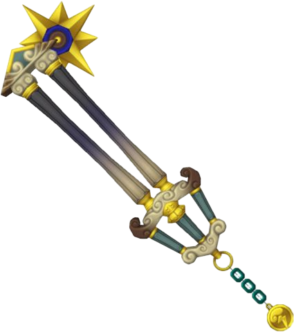
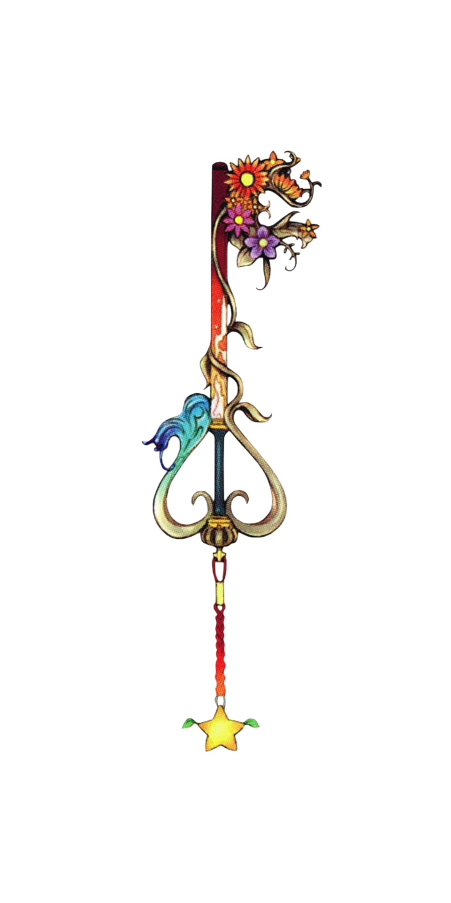

<div align="center">

  

  # ✨ May your heart be your guiding key ✨
  ### Olá, viajante dos mundos! Eu sou a Victoria Mollica 👋
  
  <p align="center">
    <b>Data Analyst</b> 🗝️ | <b>Aspiring Product Owner & Product Manager</b> 🧭 | <b>Project Organizer</b> 🛡️
  </p>
  <p align="center">
    
    
  </p>

  

</div>

<br>

---

## 📖 Jiminy's Journal // Sobre Mim

> *"They'll pay for this!"* — ou melhor, *"Eles verão o poder dos dados transformando estratégias!"*

Assim como uma verdadeira **Keyblade Wielder**, encaro cada problema de negócios como uma fechadura aguardando a chave certa:

* 📊 **Minha Arma Atual (Dados):** Transformo montanhas de dados caóticos em mapas de navegação claros, trazendo *insights* acionáveis para guiar tomadas de decisão estratégicas.
* 🧭 **Meu Destino Final (PO & PM):** Meu foco principal é a **organização, planejamento e liderança estratégica de projetos e produtos**. Conectar visão de negócios, experiência do usuário e eficiência de entregas é a minha grande paixão.
* 🌌 **Trilha de Batalha:** Construo uma base sólida na área de dados para me tornar uma **Product Leader** que decide orientada a evidências e valor real.

<br>

<div align="center">
  <table>
    <tr>
      <td align="center" width="50%">
        <br>
        <sub><b>Liderança, visão tática e estratégia para novos mundos</b></sub>
      </td>
      <td align="center" width="50%">
        <br>
        <sub><b>Energia e resiliência para transformar planos em entregas</b></sub>
      </td>
    </tr>
  </table>
</div>

---

## ⚡ Missões & Habilidades // Command Menu

```text
┌── COMMAND MENU ───────────────────────┐
│ 🗡️ [ANALYTICS]    SQL, Python, BI    │
│ 🛡️ [MANAGEMENT]   Scrum, Kanban, Jira │
│ 🪄 [MAGIC]        Product Discovery   │
│ 🗝️ [ITEMS]        Data Storytelling   │
└───────────────────────────────────────┘
